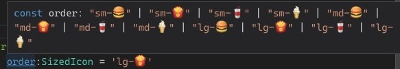

# Day 63

## TypeScript

I learned how to create union types, & String interpolate union & literal types to create multiple type combinations 

### Resources used

- [Everyday Types](https://www.typescriptlang.org/docs/handbook/2/everyday-types.html)